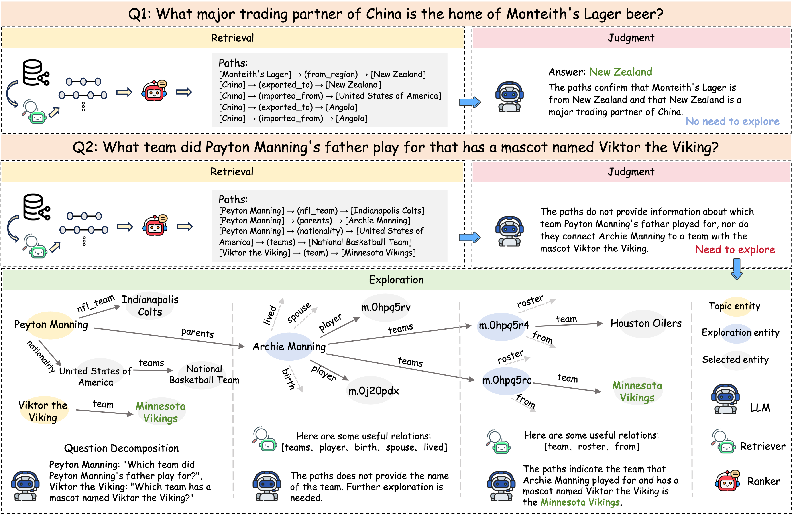

# RJE



## Knowledge Graph

Before running the system, you need to set up **Freebase** locally. Please follow the [installation instructions](https://github.com/GasolSun36/ToG/tree/main/Freebase).


## Code
Our implementation is built upon the following open-source projects:

- [PoG](https://github.com/liyichen-cly/PoG)
- [RDP](https://github.com/yooboh/RD-P)

We sincerely appreciate the authors for making their code publicly available.

## Installation

To install all required dependencies, run:

```bash
pip install -r requirements.txt
```

## Running (Example: CWQ Dataset)

### 1. Train the Relation Retriever

Run the following script to train the relation retriever:

```bash
bash ./Retriever/train_retriever.sh
```

### 2. Train the Inference Path Ranker

Run the following script to train the path ranker:

```bash
bash train_cwq_ranker.sh
```

### 3. Prepare for Running

Prepare necessary files with:

```bash
python prepare_running.py
```

### 4. Run the Model

To execute the main pipeline, run:

```bash
python rje.py \
  --dataset "cwq" \
  --max_length 2048 \
  --select_num 30 \
  --path_num 10 \
  --LLM_type "gpt35" 
```


## Evaluation

```bash
cd eval
python eval.py
```


# Citation

If you find this work useful or are inspired by it, please cite our paper:
```bibtex
@inproceedings{Lin2025RJE,
  title={RJE: A Retrieval-Judgment-Exploration Framework for Efficient Knowledge Graph Question Answering with LLMs},
  author={Lin, Can and Jiang, Zhengwang and Zheng, Ling and Zhao, Qi and Zhang, Yuhang and Song, Qi and Zhou, Wangqiu},
  booktitle={Proceedings of the 2025 Conference on Empirical Methods in Natural Language Processing},
  year={2025}
}


```